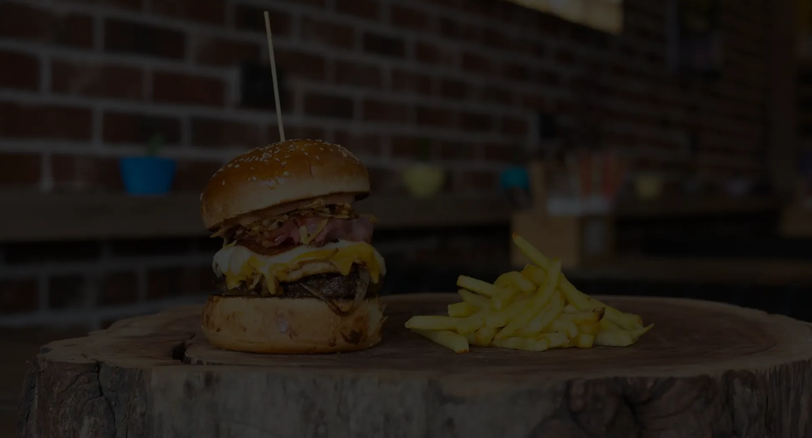

*This  was done with core understanding of React and NextJs**

Users should be able to:

- View the optimal layout for the site depending on their device's screen size

- See hover states for all interactive elements on the page

- Play with the Navigation Items

Styles Used

Font- Family : Josefin Sans And Poppins

Background Color #303032

 Red #fe1825

Feedback is always welcome through comments on message me on twitter @50strokesofkim

This is completely free. Please share it with anyone who will find it useful for practice.

Codded by Unyime Emmanuel

This is hosted live on https://uny1me.github.io/accordion